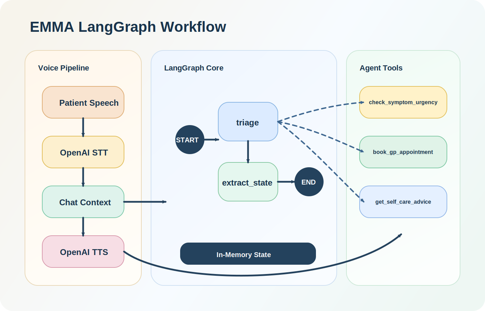

# Practice Voice Agent

A minimal voice agent built with LiveKit, OpenAI, and LangGraph. The assistant is named EMMA and behaves like a calm GP surgery receptionist in England: it collects basic patient details, triages the reason for the call, checks urgency, and either offers a GP appointment, gives self-care advice, or tells the caller to contact `999`.

## What this repository contains

- A LiveKit voice agent entrypoint in `agent.py`
- A custom LangGraph-backed LLM adapter in `emma_workflow.py`
- Three callable tools for urgency checking, booking, and self-care advice
- A tiny local test harness for the receptionist workflow

## Architecture

`agent.py` wires together the voice stack:

- STT: OpenAI `gpt-4o-mini-transcribe`
- LLM: `EmmaLiveKitLLM()`
- TTS: OpenAI `gpt-4o-mini-tts` with voice `ash`
- VAD: Silero

`emma_workflow.py` contains the conversational logic:

- Graph entrypoint: `triage`
- Second node: `extract_state`
- State fields: `messages`, `patient_info`, `triage_info`, `next_action`, `is_emergency`, `turn_count`
- Tool: `check_symptom_urgency`
- Tool: `book_gp_appointment`
- Tool: `get_self_care_advice`

## Repository layout

```text
.
├── agent.py              # LiveKit agent server and voice pipeline config
├── emma_workflow.py      # LangGraph workflow, prompts, tools, and LiveKit LLM adapter
├── .env.example          # Example environment file for local setup
├── pyproject.toml        # Project metadata and dependencies
└── docs/
    └── emma-langgraph-workflow.svg
```

## Prerequisites

Before you run the project, make sure you have:

- Python `3.12`
- `uv` for dependency management
- An OpenAI API key
- A microphone if you want to use voice console mode
- A LiveKit server or LiveKit Cloud project if you want to use `dev` or `start`

## Quick start

### 1. Install dependencies

```bash
uv sync
```

### 2. Download runtime assets

Run this once after installing dependencies:

```bash
uv run python agent.py download-files
```

This fetches the model assets needed by the agent runtime, including the VAD dependencies used by Silero.

### 3. Configure environment variables

Copy the example file:

```bash
cp .env.example .env
```

Then fill in the values:

```env
OPENAI_API_KEY=your_openai_api_key
LIVEKIT_URL=wss://your-project.livekit.cloud
LIVEKIT_API_KEY=your_livekit_api_key
LIVEKIT_API_SECRET=your_livekit_api_secret
```

Notes:

- `OPENAI_API_KEY` is required in every mode because STT, TTS, and the workflow LLM all use OpenAI.
- `LIVEKIT_URL`, `LIVEKIT_API_KEY`, and `LIVEKIT_API_SECRET` are required for LiveKit-backed modes such as `dev` and `start`.
- Both Python entrypoints call `load_dotenv(override=True)`, so values from `.env` are loaded automatically.
- The current codebase does not use Deepgram, ElevenLabs, or a multilingual turn detector.

## How to run the voice agent yourself

### Option 1: Run locally in console mode

This is the easiest way to test the agent on your own machine.

```bash
uv run python agent.py console
```

Useful console options:

- List audio devices: `uv run python agent.py console --list-devices`
- Run in text mode: `uv run python agent.py console --text`
- Choose an input device: `uv run python agent.py console --input-device "<device name>"`
- Choose an output device: `uv run python agent.py console --output-device "<device name>"`

What to expect:

- The agent starts a local session and waits for you to speak.
- Your speech is transcribed, routed through the LangGraph workflow, and spoken back with OpenAI TTS.
- If the startup succeeds, you should see the process remain active and the agent log `assistant ready`.

### Option 2: Run in LiveKit dev mode

If you want to connect the agent to LiveKit for development:

```bash
uv run python agent.py dev
```

The registered agent name is:

```text
practice-voice-agent
```

Use this mode when you want to connect from the LiveKit playground or another LiveKit client while auto-reload is enabled.

### Option 3: Run the worker without auto-reload

For a steadier worker-style process:

```bash
uv run python agent.py start
```

## Local workflow smoke test

If you only want to test the receptionist logic without opening LiveKit console mode, run:

```bash
uv run python emma_workflow.py
```

This executes a built-in sample conversation and prints EMMA's replies in the terminal. It is the fastest way to confirm that:

- your OpenAI key works
- the LangGraph workflow is callable
- emergency escalation logic is being triggered

## How the LangGraph workflow behaves

The graph is intentionally small:

1. `triage`
2. `extract_state`
3. `END`

What happens inside `triage`:

- A system prompt is built from the current state
- The triage model decides whether to answer directly or call tools
- If a tool is called, its result is fed back into the model as an internal observation
- The final patient-facing reply is kept short for voice interactions

What happens inside `extract_state`:

- The conversation is converted into a structured prompt
- A second model extracts patient name, date of birth, complaint, severity, and red flags
- The extracted values are merged into the in-memory workflow state

## Current tool behavior

`check_symptom_urgency` uses keyword matching and returns one of:

- `emergency`
- `urgent`
- `routine`

`book_gp_appointment` is currently a stub that returns a confirmation string rather than integrating with a booking system.

`get_self_care_advice` returns canned guidance for:

- `cold`
- `sore throat`
- `minor cut`

Everything else falls back to a general advice message.

## Safety and scope

This repository is a demo, not a production clinical system.

- It does not diagnose conditions
- It uses simple keyword logic for urgency
- It stores conversation state in memory only
- It does not integrate with EHR, scheduling, or identity verification systems
- It should not be used as a substitute for real medical triage workflows

## Troubleshooting

- If `console` cannot hear you, run `uv run python agent.py console --list-devices` and select devices explicitly.
- If the agent fails before speaking, confirm that `OPENAI_API_KEY` is set in `.env`.
- If `dev` or `start` fails to connect, re-check `LIVEKIT_URL`, `LIVEKIT_API_KEY`, and `LIVEKIT_API_SECRET`.
- If the first run is slow or errors on missing assets, run `uv run python agent.py download-files` again.
- If you want a text-only sanity check, run `uv run python emma_workflow.py`.

## Limitations worth knowing before you extend it

- `should_end_call()` is only used in the local workflow test helper and is not currently wired into LiveKit session shutdown.
- Emergency detection is based on hard-coded symptom phrases.
- Appointment booking is mocked.
- State is not persisted across process restarts.
- There are no automated tests yet.

## Contributing

If you want to extend the project:

1. Install dependencies with `uv sync`
2. Make your changes
3. Run `uv run python emma_workflow.py` for a quick logic check
4. Run `uv run python agent.py console --text` for a low-friction interaction test

## License

No license file has been added yet. If you plan to publish this repository publicly, add a license before accepting outside contributions or reuse.
